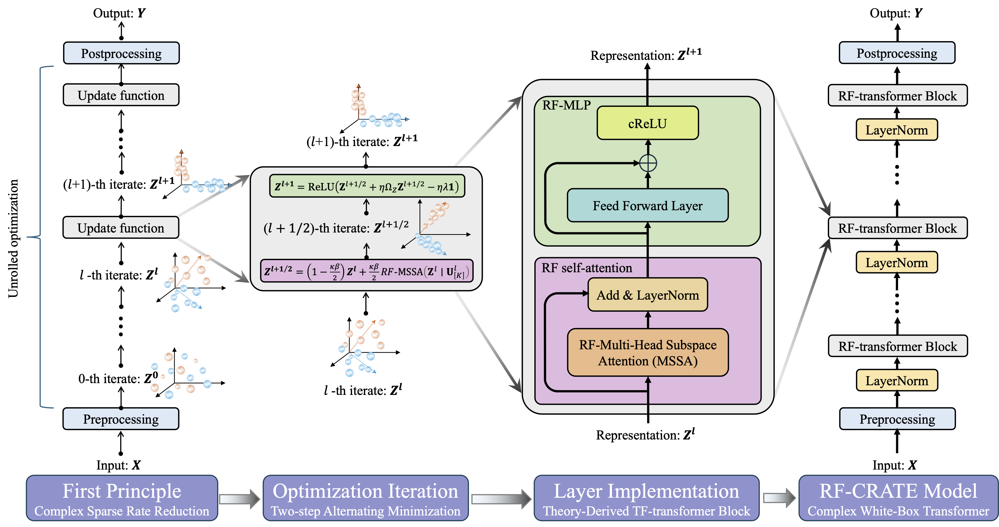

# RF-CRATE

This repository contains the code for the paper:

> RF-CRATE: Interpretable Deep Wireless Sensing via White-Box Transformer

We present RF-CRATE, the first fully interpretable deep network architecture for RF sensing. 
RF-CRATE is built upon CRATE, a recent milestone in deep representation learning constructed on the first principles of sparse rate reduction. 
RF-CRATE adapts the original real-valued CRATE to handle complex RF data by mathematically extending the self-attention module and the MLP module based on the CR-Calculus framework, resulting in the first fully complex-valued white-box transformer. 
